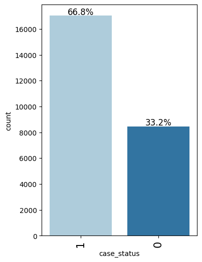

# 🧠 EasyVisa — Visa Approval Prediction using Machine Learning
### CRISP-DM Based Analytics Project  
**Author:** Swaroop Narayan  
**Programs:** MBA (Finance & Analytics, ISBR – Expected Nov 2025) | MSc in Analytics (Expected Nov 2026)

---

## 🎯 Objective

The goal of this project is to **predict visa approval outcomes** using applicant and case attributes.  
The system helps **visa officers** and **consultants** make informed decisions by identifying key approval factors and minimizing **false positives** (wrongly approved) and **false negatives** (wrongly rejected).

The **Gradient Boosting Classifier** emerged as the top-performing model with a **high F1-score**, providing the best trade-off between precision and recall.

---

## ⚙️ CRISP-DM Framework Overview

| Phase | Description | Deliverables |
|--------|--------------|---------------|
| **1. Business Understanding** | Define business problem and goals | `1_Business_Understanding/business_objectives.md` |
| **2. Data Understanding** | Explore dataset, identify patterns, visualize insights | `2_Data_Understanding/data_description.md` and visuals |
| **3. Data Preparation** | Clean, encode, and scale data | `3_Data_Preparation/preprocessing_steps.md` |
| **4. Modeling** | Train and evaluate ML models | `4_Modeling/model_building_notes.md` |
| **5. Evaluation** | Compare model performance and metrics | `5_Evaluation/model_evaluation_summary.md` |
| **6. Deployment** | Propose real-world deployment plan | `6_Deployment/deployment_plan.md` |

---

## 🧩 Dataset Summary

The EasyVisa dataset contains visa applications with fields such as:

- Applicant demographics (country, occupation, education)
- Employer information
- Job type and salary
- Application type and processing center
- Outcome (`Approved` / `Denied`)

---

## 🔍 Exploratory Data Analysis (EDA)

Visuals located in `2_Data_Understanding/visuals/` illustrate:

| Visualization | Description |
|----------------|--------------|
|  | Distribution of approved vs denied cases |
|  | Top applicant countries and their success rates |
|  | Relationships between numerical features |

Insights:
- Most applicants come from a few key regions.
- Visa denial rates increase for lower salary brackets.
- Education and employer sponsorship show high correlation with approval.

---

## 🧮 Modeling

Models trained:
- **Logistic Regression** — baseline  
- **Random Forest (Bagging)** — strong but overfitting observed  
- **Gradient Boosting Classifier** — best performance overall  

**Best Model: Gradient Boosting Classifier**

📊 Key Visuals (from `4_Modeling/visuals/`):

| Visualization | Description |
|----------------|--------------|
|  | Top features influencing visa approval |
|  | Classification performance visualization |
|  | Model discrimination capability |

---

## 📈 Results Summary

| Metric | Gradient Boosting | Random Forest | Logistic Regression |
|---------|-------------------|----------------|---------------------|
| Accuracy | High | Moderate | Baseline |
| Precision | High | Moderate | Low |
| Recall | High | Moderate | Low |
| **F1-Score** | **Highest** | Moderate | Low |

✅ **Gradient Boosting achieved the highest F1-score**, effectively minimizing both **false positives** and **false negatives**.

---

## 💡 Business Impact

- Helps visa authorities **prioritize accurate case assessments**.  
- Reduces **risk of incorrect approvals/denials**.  
- Can be deployed as a **decision-support tool** integrated into internal visa processing systems.  
- Improves **transparency** in application review.

---

## 🚀 Deployment Roadmap

Outlined in `6_Deployment/deployment_plan.md`:
1. Export trained model (`.joblib` or `.pkl`)
2. Deploy via API (FastAPI / Flask)
3. Build dashboard for officers
4. Implement continuous retraining with drift monitoring

---

## 🧠 Tech Stack

- **Python**
- **pandas**, **numpy**, **scikit-learn**
- **matplotlib**, **seaborn**
- **xgboost**
- **Jupyter Notebook**

---

## 🧾 How to Use

1. Clone or download this repository  
2. Install dependencies  
   ```bash
   pip install -r requirements.txt
   ```
3. Open the notebook:  
   ```bash
   jupyter notebook Easy_Visa_Assignment_updated.ipynb
   ```
4. Run all cells to reproduce the workflow and results.

---

## 👤 Author

**Swaroop Narayan**  
MBA (Finance & Analytics) – ISBR Business School, Bangalore  
MSc in Analytics – Expected 2026  

LinkedIn: [Your LinkedIn URL here]  
Email: [Your email address]

---

## 📜 License

This project is released under the MIT License.  
See `LICENSE` for details.
